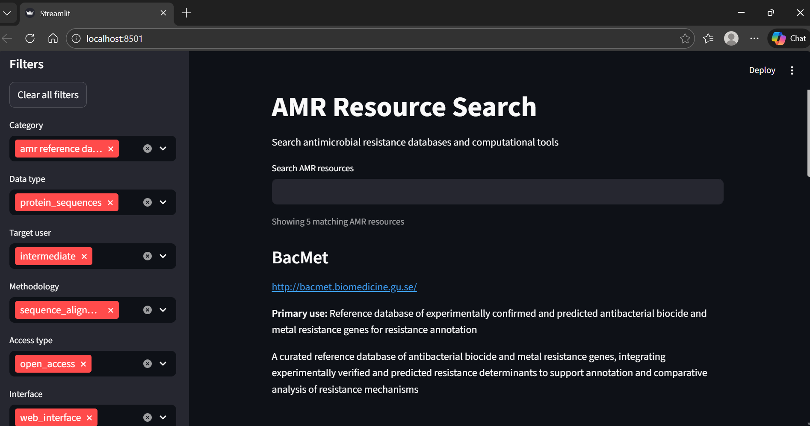

# amr-resource-search
A domain-specific search engine for antimicrobial resistance databases and computational tools

## Overview

AMR Resource Search is a domain-specific search engine for discovering antimicrobial resistance (AMR) databases and computational tools. It is designed to help researchers quickly identify relevant AMR resources based on functionality and user intent, rather than relying on generic web search.

## Motivation

AMR databases and tools are scattered across publications, websites, and repositories, making discovery time-consuming and inefficient. This project addresses that gap by providing a curated, searchable metadata layer focused exclusively on AMR resources.

## Dataset

The core dataset is provided as a curated Excel file containing 30 AMR databases and tools.

The Excel file consists of three sheets:
1. AMR_Databases_and_Tools – main indexed dataset
2. Controlled_Vocabulary – standardized values for selected categorical fields  to enable consistent filtering and indexing
3. Column_Definitions – metadata describing each column

The dataset was manually curated to ensure accuracy, relevance, and consistency.

## Search Logic

Search is performed using keyword-based matching across selected fields, including:
- database/tool name
- fullform
- primary_use
- description
- tags

All text is normalized during search (lowercasing, whitespace trimming) to ensure consistent matching.

## Ranking Strategy

Search results are ranked using a simple weighted matching strategy:
- Matches in the database/tool name and its fullform are prioritized
- Matches in primary_use receive intermediate weight
- Tag matches receive intermediate weight
- Description matches receive lower weight

This approach balances precision and recall while keeping the system interpretable. An internal relevance score is computed for ranking and is not exposed in the user interface. Results are ranked by cumulative relevance across multiple metadata fields.

## Filtering

Filterable attributes include:
- category
- data_type
- methodology
- access_type
- interface
- target_user

Species coverage is displayed for informational purposes and is not used for filtering or ranking.

## Implementation

- Language: Python  
- Libraries: pandas, Streamlit  
- Data source: Excel (.xlsx)  

Standard parsing libraries are used; no custom CSV string splitting is performed.

## Evaluation (Exploratory)

This project implements a rule-based information retrieval system over a curated dataset of 30 AMR-related databases and tools. As no benchmark relevance-labelled dataset exists for this task, an exploratory evaluation was conducted to assess relevance ranking behavior.

### Relevance Definition
A resource is considered relevant to a search query if the query term matches any of the searchable metadata fields used by the system, including the database/tool name, primary use, curated tags, or description. Relative relevance among multiple matching resources is determined using a weighted ranking scheme, with higher importance assigned to matches in the database/tool name, followed by fullform, tags, primary use and description.

### Evaluation Setup
- Dataset size: 30 curated AMR resources  
- Query set: 5 representative queries  
- Query selection: Queries were derived from controlled vocabulary concepts and expressed as realistic free-text user inputs  
- Relevance annotation: Manual, based on curated metadata  
- Metrics: Precision and Recall  
- Purpose: Exploratory assessment of metadata-driven relevance ranking  

### Evaluation Queries
The following queries were used to evaluate the system:
- `surveillance`
- `phylogenetic`
- `real time clustering`
- `protein sequence`
- `variant`

### Results (Indicative)
| Query                  | Precision   | Recall |
|------------------------|-------------|--------|
| surveillance           | 1           | 1      |
| phylogenetic           | 1           | 1      |
| real time clustering   | NA          | 0      |
| protein sequence       | 1           | 1      |
| variant                | 1           | 1      |

- Mean Precision: **1** (excluding queries with no retrieved results)
- Mean Recall: **0.80**

### Interpretation
Higher precision was observed for queries associated with well-curated and standardized metadata, while recall varied depending on the presence and consistency of relevant concepts across searchable fields. Queries related to specialized methodologies (e.g: real time clustering) exhibited lower recall due to limited representation in metadata fields rather than the ranking errors.

### Limitations
- Evaluation relies on a small, manually curated query set and subjective relevance judgments 
- Results are indicative of ranking behavior and are not intended as benchmark performance

## Future Work

Planned extensions include:
- Improved web-based user interface
- Expanded AMR resource coverage
- Ontology-based tagging
- Automated updates and validation

## Live app
🔗 https://amr-resource-search-tbx8qkx4mqt2dg3dfuzi96.streamlit.app/

## Screenshots

